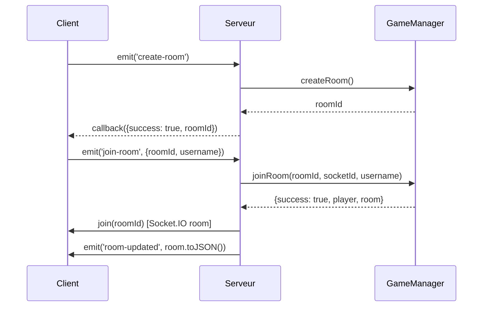
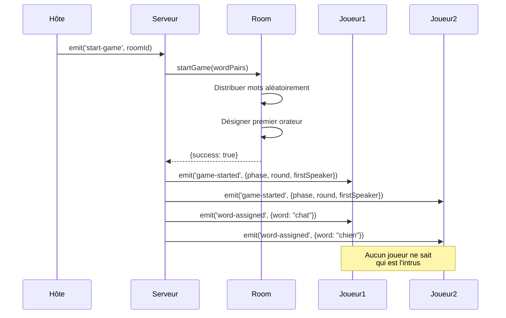

# Architecture Technique - The Impostor

## Vue d'ensemble

Architecture client-serveur temps réel avec Socket.IO, organisée en monorepo pnpm.

```
┌─────────────┐         WebSocket          ┌─────────────┐
│   Client    │ ◄─────────────────────────► │   Serveur   │
│   React     │    Socket.IO (port 3001)    │  Node.js    │
│  (port 5173)│                              │   Express   │
└─────────────┘                              └─────────────┘
```

## Structure des Dossiers

```
TheImpostor/
├── client/                     # Application React
│   ├── src/
│   │   ├── pages/             # Pages React Router
│   │   │   ├── Home.jsx       # Créer/Rejoindre salon
│   │   │   ├── Lobby.jsx      # Salle d'attente
│   │   │   └── Game.jsx       # Partie en cours
│   │   ├── contexts/
│   │   │   └── SocketContext.jsx  # Context Socket.IO global
│   │   ├── utils/
│   │   │   └── constants.js   # Configuration
│   │   ├── App.jsx            # Router principal
│   │   └── index.css          # Styles Tailwind
│   ├── public/
│   ├── index.html
│   ├── vite.config.js
│   ├── tailwind.config.js
│   └── package.json
│
├── server/                     # Serveur Node.js
│   ├── src/
│   │   ├── game/              # Logique métier
│   │   │   ├── GameManager.js # Singleton, gère tous les salons
│   │   │   ├── Room.js        # Représente un salon
│   │   │   └── Player.js      # Représente un joueur
│   │   ├── socket/
│   │   │   └── socketHandler.js  # Événements Socket.IO
│   │   ├── data/
│   │   │   └── wordPairs.js   # ~355 paires de mots
│   │   └── utils/
│   │       └── logger.js      # Logger horodaté
│   ├── index.js               # Point d'entrée Express
│   └── package.json
│
├── docs/                       # Documentation
│   ├── 01-analyse/
│   ├── 02-conception/
│   └── 03-developpement/
│
├── pnpm-workspace.yaml         # Configuration monorepo
├── package.json                # Scripts racine
└── README.md
```

## Composants Principaux

### 1. GameManager (Singleton)

**Rôle** : Gestionnaire central de tous les salons de jeu.

```javascript
class GameManager {
  rooms: Map<string, Room>
  disconnectedPlayers: Map<string, DisconnectedPlayer>

  createRoom(maxPlayers) → roomId
  getRoom(roomId) → Room
  joinRoom(roomId, socketId, username) → {success, player, room}
  handlePlayerDisconnect(socketId) → DisconnectionInfo
}
```

**Responsabilités :**

-   Créer des salons (code unique 8 caractères)
-   Gérer le cycle de vie des salons
-   Gérer les déconnexions/reconnexions (fenêtre 2min)
-   Nettoyer les salons vides

### 2. Room

**Rôle** : Représente un salon de jeu avec ses joueurs et son état.

```javascript
class Room {
  id: string
  players: Player[]
  maxPlayers: number (10)
  started: boolean
  currentPair: {team: string, intruder: string}
  gameState: {
    phase: 'waiting' | 'playing' | 'voting' | 'paused' | 'ended'
    currentRound: number
    firstSpeaker: string
    votes: Map
    votedPlayers: Set
    voteInitiator: string
    winner: string[]
  }

  addPlayer(socketId, username) → Player
  removePlayer(socketId) → Player
  startGame(wordPairs) → {success, gameState}
  canStart() → boolean

  // Méthodes de sérialisation
  toJSON() → object           // Pour liste des salons
  toGameJSON(playerId) → object   // Pour clients (SANS isImpostor)
  toServerJSON() → object     // Pour serveur uniquement (AVEC isImpostor)
}
```

**⚠️ Règle critique :** `toGameJSON()` ne doit JAMAIS exposer `isImpostor` au client.

### 3. Player

**Rôle** : Représente un joueur dans le jeu.

```javascript
class Player {
  id: string (socket ID)
  username: string
  isHost: boolean
  isAlive: boolean
  score: number
  currentWord: string
  isImpostor: boolean  // ⚠️ JAMAIS transmis au client

  resetForNewRound()
  addPoints(points)
  hasWon(winningScore) → boolean
  toJSON(hideWord) → object
}
```

### 4. SocketContext (Client)

**Rôle** : Context React pour partager la connexion Socket.IO dans toute l'app.

```javascript
SocketProvider {
  socket: useRef(io(SERVER_URL))  // Une seule instance
  isConnected: boolean
  error: string
}
```

**Principe :** Une seule connexion Socket.IO pour toute l'application React.

## Flux de Communication

### 1. Création et Rejoindre un Salon



### 2. Démarrage de Partie



## Gestion des États

### États du Salon (Room.gameState.phase)

```
┌─────────┐  start-game  ┌─────────┐  initiate-vote  ┌─────────┐
│ waiting │─────────────►│ playing │────────────────►│ voting  │
└─────────┘              └─────────┘                 └─────────┘
     ▲                        │                            │
     │                        │ disconnect (<3 players)    │
     │                        ▼                            │
     │                   ┌─────────┐                       │
     │                   │ paused  │                       │
     │                   └─────────┘                       │
     │                        │                            │
     │                        │ reconnect                  │
     │                        ▼                            │
     │                   ┌─────────┐                       │
     └───────────────────│  ended  │◄──────────────────────┘
```

### États de Connexion (SocketContext)

```
┌──────────┐  connect  ┌───────────┐  join-room  ┌──────────┐
│ offline  │──────────►│ connected │────────────►│ in-lobby │
└──────────┘           └───────────┘             └──────────┘
                            │                          │
                            │                          │ start-game
                            │                          ▼
                            │                     ┌──────────┐
                            │ disconnect          │ in-game  │
                            ◄─────────────────────┴──────────┘
```

## Sécurité et Confidentialité

### Règle de Confidentialité des Rôles

**Principe :** Le client ne doit JAMAIS connaître le statut `isImpostor` d'un joueur.

**Mise en œuvre :**

```javascript
// ❌ INTERDIT : Envoyer directement les players
io.to(roomId).emit("data", room.players);

// ✅ CORRECT : Utiliser toGameJSON()
io.to(roomId).emit("data", room.toGameJSON());

// ✅ CORRECT : Pour calculs serveur (Sprint 2)
const serverData = room.toServerJSON();
const impostor = serverData.players.find((p) => p.isImpostor);
```

**Méthodes de sérialisation :**

| Méthode                | Usage            | Contient isImpostor |
| ---------------------- | ---------------- | ------------------- |
| `toJSON()`             | Liste des salons | ❌ Non              |
| `toGameJSON(playerId)` | Données client   | ❌ Non              |
| `toServerJSON()`       | Calculs serveur  | ✅ Oui              |

## Technologies et Dépendances

### Client

```json
{
    "react": "^18.2.0",
    "react-router-dom": "^6.20.0",
    "socket.io-client": "^4.7.2",
    "tailwindcss": "^3.3.6",
    "vite": "^5.0.8"
}
```

### Serveur

```json
{
    "express": "^4.18.2",
    "socket.io": "^4.7.2",
    "cors": "^2.8.5",
    "nanoid": "^5.0.4"
}
```

## Configuration CORS

**Développement :**

```javascript
const corsOptions = {
    origin: "http://localhost:5173",
    credentials: true,
};

app.use(cors(corsOptions));

const io = new Server(httpServer, {
    cors: corsOptions,
});
```

## Événements Socket.IO

### Client → Serveur

| Événement       | Paramètres           | Callback                  | Description           |
| --------------- | -------------------- | ------------------------- | --------------------- |
| `create-room`   | -                    | `{success, roomId}`       | Créer un salon        |
| `join-room`     | `{roomId, username}` | `{success, room, player}` | Rejoindre un salon    |
| `start-game`    | `roomId`             | `{success, gameState}`    | Démarrer la partie    |
| `get-room-info` | `roomId`             | `{success, room}`         | Récupérer infos salon |

### Serveur → Client

| Événement             | Données                               | Description                  |
| --------------------- | ------------------------------------- | ---------------------------- |
| `room-updated`        | `room.toJSON()`                       | Mise à jour du salon         |
| `game-started`        | `{phase, currentRound, firstSpeaker}` | Partie démarrée              |
| `word-assigned`       | `{word}`                              | Attribution du mot personnel |
| `player-disconnected` | `{username}`                          | Déconnexion d'un joueur      |

## Gestion des Erreurs

### Côté Serveur

```javascript
try {
    // Logique métier
} catch (error) {
    logger.error("Erreur:", error);
    if (callback) {
        callback({ success: false, message: error.message });
    }
}
```

### Côté Client

```javascript
socket.on("connect_error", (err) => {
    console.error("❌ Erreur de connexion:", err.message);
    setError(err.message);
    setIsConnected(false);
});
```

## Performance

### Optimisations Client

-   Vite avec SWC (compilation rapide)
-   Code splitting automatique
-   Tailwind JIT mode
-   Une seule connexion Socket.IO (useRef)

### Optimisations Serveur

-   Singleton GameManager
-   Cleanup périodique (30s) des joueurs déconnectés
-   Logs structurés avec horodatage

## Déploiement

### Prérequis

-   VPS avec Node.js >= 16
-   Ports ouverts : 3001 (serveur), 80/443 (client)

### Build Production

```bash
# Client
cd client
pnpm run build  # Génère dist/

# Serveur
cd server
pnpm start      # Mode production
```

---

**Version** : 1.0  
**Dernière mise à jour** : 29 décembre 2024
